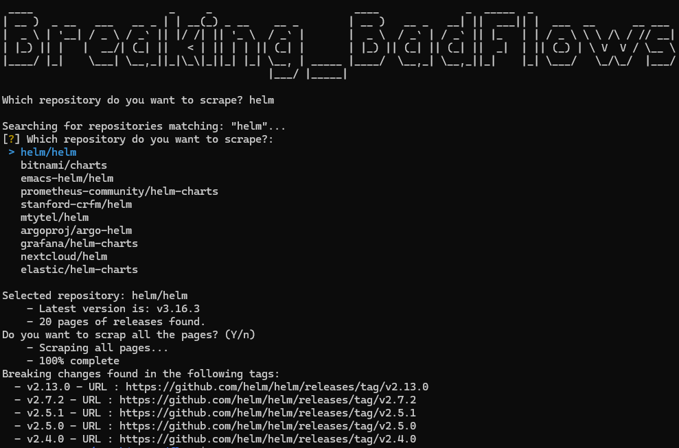

# BreakingBadFlows

Because we all hate breaking changes

## Overview

BreakingBadFlows is a Python script designed to scrape GitHub repositories for release notes and identify breaking changes.

## Features

- Search for GitHub repositories by name.
- Scrape release notes for breaking changes.
- Display tags with breaking changes in a formatted manner.
- Multi-threaded scraping for faster performance.

## Example :

